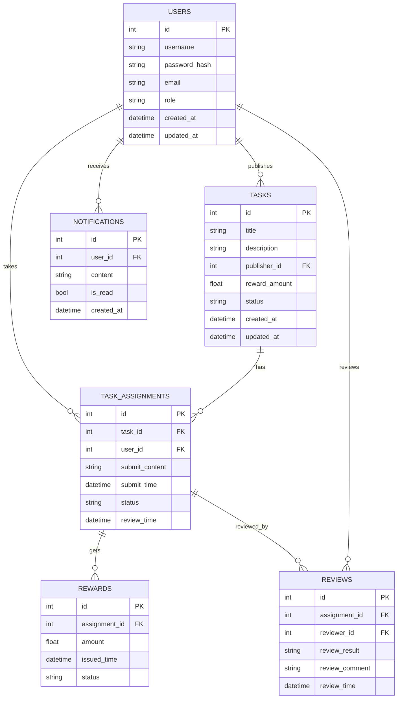

# 数据库表结构设计

本项目核心数据表结构如下：

## 1. 表结构说明

### 用户表（users）
- id（主键，自增）
- username（唯一，索引）
- password_hash
- email
- role（普通用户/发布者/管理员）
- created_at
- updated_at

### 任务表（tasks）
- id（主键，自增）
- title
- description
- publisher_id（外键，关联 users.id）
- reward_amount
- status（待接取/进行中/待审核/已完成/已关闭）
- created_at
- updated_at

### 任务接取表（task_assignments）中间表
- id（主键，自增）
- task_id（外键，关联 tasks.id）
- user_id（外键，关联 users.id）
- submit_content
- submit_time
- status（task_pending:进行中/待审核 | task_receive:接取被接收 | task_receivement_rejected:接取被拒绝 | task_completed:任务已完成 | task_reject:提交被拒绝 | appealing:申诉中）
- review_time

### 奖励结算表（rewards） 中间表
- id（主键，自增）
- assignment_id（外键，关联 task_assignments.id）
- amount
- issued_time
- status（已发放/待发放）

### 申诉/审核表（reviews）
- id（主键，自增）
- assignment_id（外键，关联 task_assignments.id） 中间表
- reviewer_id（外键，关联 users.id）
- review_result（通过/不通过/申诉中）
- review_comment
- review_time

### 消息通知表（notifications）
- id（主键，自增）
- user_id（外键，关联 users.id）
- content
- is_read
- created_at

---

## 2. ER 图（Mermaid 语法）



---

## 3. 任务接取状态流转说明

### task_assignments 表状态枚举值

| 状态值 | 中文说明 | 业务含义 |
|-------|---------|---------|
| `task_pending` | 进行中/待审核 | 用户接取任务后的默认状态，包括正在做和已提交等待审核 |
| `task_receive` | 接取被接收 | 管理员审核接取申请通过，允许用户开始做任务 |
| `task_receivement_rejected` | 接取被拒绝 | 管理员拒绝用户接取任务的申请 |
| `task_completed` | 任务已完成 | 用户提交作业后，管理员审核通过，任务真正完成 |
| `task_reject` | 提交被拒绝 | 用户提交作业后，管理员认为质量不合格而拒绝 |
| `appealing` | 申诉中 | 用户对审核结果不满意，提出申诉 |

### 状态流转图

```
[用户接取任务]
    ↓
[task_pending] ← 默认初始状态
    ↓ (管理员审核接取申请)
    ├─ 接取通过 → [task_receive] ← 允许做任务
    │                   ↓ (用户提交作业)
    │              [等待审核]
    │                   ↓ (管理员审核作业)
    │                   ├─ 审核通过 → [task_completed] ← 真正完成
    │                   │                    ↓
    │                   │              (用户申诉) → [appealing]
    │                   │
    │                   └─ 审核拒绝 → [task_reject] ← 质量不合格
    │                                      ↓
    │                                (用户申诉) → [appealing]
    │
    └─ 接取拒绝 → [task_receivement_rejected] ← 不允许做任务
```

### 关键业务逻辑

1. **接取任务**: 用户接取任务时，状态初始化为 `task_pending`
2. **审核接取**: 
   - 通过 → `task_receive` (用户可以开始做任务)
   - 拒绝 → `task_receivement_rejected` (不允许做任务)
3. **提交作业**: 用户在 `task_receive` 状态下提交作业，等待管理员审核
4. **审核作业**:
   - 通过 → `task_completed` (任务完成，发放奖励)
   - 拒绝 → `task_reject` (作业不合格)
5. **申诉**: 只有 `task_completed` 或 `task_reject` 状态可以申诉，状态变为 `appealing`

---


