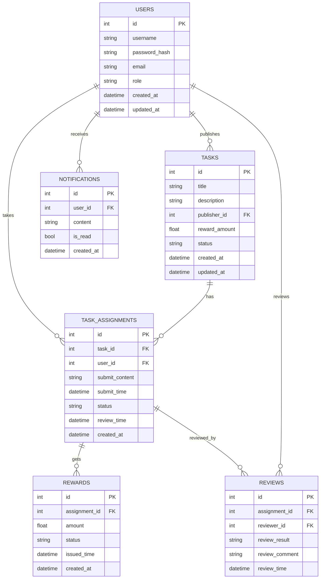

# 数据库表结构设计

本项目核心数据表结构如下：

## 1. 表结构说明

### 用户表（users）
- id（主键，自增）
- username（唯一，索引）
- password_hash
- email
- role（普通用户/发布者/管理员）
- created_at（记录创建时间）
- updated_at（记录更新时间）

### 任务表（tasks）
- id（主键，自增）
- title（任务标题）
- description（任务描述）
- publisher_id（外键，关联 users.id）
- reward_amount（奖励金额）
- status（待接取/进行中/待审核/已完成/已关闭）
- created_at（任务创建时间）
- updated_at（任务更新时间）

### 任务接取表（task_assignments）
- id（主键，自增）
- task_id（外键，关联 tasks.id）
- user_id（外键，关联 users.id）
- submit_content（提交内容）
- submit_time（提交时间）
- status（待审核/已通过/未通过/申诉中）
- review_time（审核时间）
- created_at（接取创建时间）

### 奖励结算表（rewards）
- id（主键，自增）
- assignment_id（外键，关联 task_assignments.id）
- amount（奖励金额）
- issued_time（发放时间）
- status（已发放/待发放/发放失败）
- created_at（奖励创建时间）

### 申诉/审核表（reviews）
- id（主键，自增）
- assignment_id（外键，关联 task_assignments.id）
- reviewer_id（外键，关联 users.id）
- review_result（通过/不通过/申诉中）
- review_comment（审核评语）
- review_time（审核时间）

### 消息通知表（notifications）
- id（主键，自增）
- user_id（外键，关联 users.id）
- content（通知内容）
- is_read（是否已读）
- created_at（通知创建时间）

---

## 2. 状态枚举详细说明

### 任务状态（tasks.status）
- `open` - 待接取：任务已发布，等待用户接取
- `in_progress` - 进行中：已有用户接取并正在执行
- `pending_review` - 待审核：用户已提交，等待审核
- `completed` - 已完成：任务已通过审核并结算
- `closed` - 已关闭：任务已结束或取消

### 任务接取状态（task_assignments.status）
- `pending_review` - 待审核：用户已提交任务成果，等待审核
- `approved` - 已通过：任务成果通过审核，等待奖励发放
- `rejected` - 未通过：任务成果未通过审核，可重新提交
- `appealing` - 申诉中：用户对审核结果有异议，正在申诉

### 审核结果（reviews.review_result）
- `pending` - 待审核：审核尚未开始
- `approved` - 通过：任务成果符合要求
- `rejected` - 未通过：任务成果不符合要求
- `appealing` - 申诉中：用户已发起申诉

### 奖励状态（rewards.status）
- `pending` - 待发放：奖励已创建，等待发放
- `issued` - 已发放：奖励已成功发放到用户账户
- `failed` - 发放失败：因系统或用户账户问题导致发放失败

---

## 3. ER 图（Mermaid 语法）



---

## 4. 数据库扩展说明

### 4.1 时间戳字段扩展
所有主要业务表都增加了 `created_at` 字段，用于：
- 📊 **业务分析**：支持按时间维度统计和分析
- 🔍 **问题排查**：快速定位特定时间段的问题
- 📈 **趋势监控**：监控业务增长和用户活跃度
- ⚖️ **合规审计**：满足数据审计要求

### 4.2 状态枚举扩展

#### 任务接取状态增加 `appealing` (申诉中)
**业务场景**：
- 用户对审核结果不满意时可发起申诉
- 申诉期间任务状态保持"申诉中"，避免重复审核
- 为平台提供争议处理机制

**状态流转**：
```
pending_review → approved/rejected → appealing → approved/rejected
```

#### 奖励状态增加 `failed` (发放失败)
**业务场景**：
- 支付系统故障导致奖励发放失败
- 用户账户异常（如被冻结）
- 银行信息错误导致转账失败

**处理机制**：
- 财务人员可进行失败重试或人工处理
- 提供完整的奖励发放状态追踪

### 4.3 索引优化设计

#### 核心查询优化
```sql
-- 用户中心高频查询
SELECT * FROM task_assignments
WHERE user_id = ? AND status = 'pending_review'
ORDER BY created_at DESC;

-- 运营统计查询
SELECT COUNT(*) FROM tasks WHERE status = 'open';
SELECT SUM(amount) FROM rewards WHERE status = 'pending';
```

#### 索引覆盖场景
- 🚀 **用户体验**：用户任务列表快速加载
- 💼 **运营效率**：后台统计报表实时生成
- 💰 **财务准确**：奖励结算查询快速准确

### 4.4 数据完整性保障

#### 级联删除设计
当父表记录删除时，相关子表记录自动清理：
- 用户删除 → 删除其所有任务、接取记录、通知
- 任务删除 → 删除所有接取记录、审核记录、奖励
- 保持数据一致性，避免孤立记录

#### 唯一性约束
- **任务防重复接取**：`(task_id, user_id)` 唯一约束
- **奖励防重复发放**：`assignment_id` 唯一约束
- 从数据库层面保证业务规则的强制执行

---


