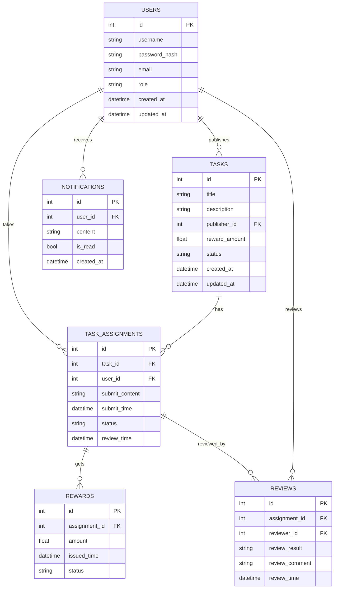

# 数据库表结构设计

本项目核心数据表结构如下：

## 1. 表结构说明

### 用户表（users）
- id（主键，自增）
- username（唯一，索引）
- password_hash
- email
- role（普通用户/发布者/管理员）
- created_at
- updated_at

### 任务表（tasks）
- id（主键，自增）
- title
- description
- publisher_id（外键，关联 users.id）
- reward_amount
- status（待接取/进行中/待审核/已完成/已关闭）
- created_at
- updated_at

### 任务接取表（task_assignments）
- id（主键，自增）
- task_id（外键，关联 tasks.id）
- user_id（外键，关联 users.id）
- submit_content
- submit_time
- status（待审核/已通过/未通过）
- review_time

### 奖励结算表（rewards）
- id（主键，自增）
- assignment_id（外键，关联 task_assignments.id）
- amount
- issued_time
- status（已发放/待发放）

### 申诉/审核表（reviews）
- id（主键，自增）
- assignment_id（外键，关联 task_assignments.id）
- reviewer_id（外键，关联 users.id）
- review_result（通过/不通过/申诉中）
- review_comment
- review_time

### 消息通知表（notifications）
- id（主键，自增）
- user_id（外键，关联 users.id）
- content
- is_read
- created_at

---

## 2. ER 图（Mermaid 语法）

---

