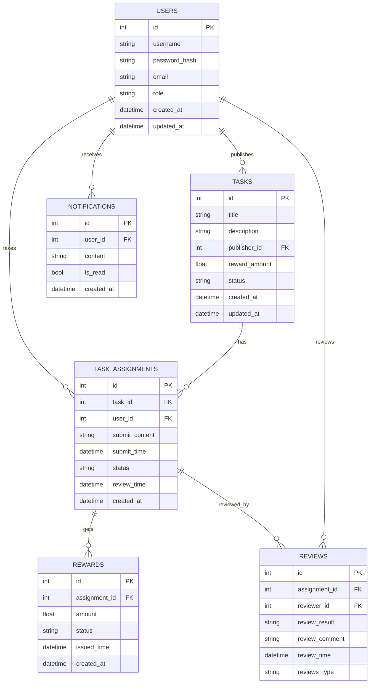

# 数据库表结构设计

本项目核心数据表结构如下：

## 1. 表结构说明

### 用户表（users）
- id（主键，自增）
- username（唯一，索引）
- password_hash
- email
- role（普通用户/发布者/管理员）
- created_at（记录创建时间）
- updated_at（记录更新时间）

### 任务表（tasks）
- id（主键，自增）
- title（任务标题）
- description（任务描述）
- publisher_id（外键，关联 users.id）
- reward_amount（奖励金额）
- status（待接取/进行中/待审核/已完成/已关闭）
- created_at（任务创建时间）
- updated_at（任务更新时间）

### 任务接取表（task_assignments）中间表
- id（主键，自增）
- task_id（外键，关联 tasks.id）
- user_id（外键，关联 users.id）
- submit_content
- submit_time
- status（task_pending:进行中/待审核 | task_receive:接取被接收 | task_receivement_rejected:接取被拒绝 |assignment_submission_pending|task_completed:任务已完成 | task_reject:提交被拒绝 | appealing:申诉中）
- review_time

### 奖励结算表（rewards） 中间表
- id（主键，自增）
- assignment_id（外键，关联 task_assignments.id）
- amount（奖励金额）
- issued_time（发放时间）
- status（已发放/待发放/发放失败）
- created_at（奖励创建时间）

### 申诉/审核表（reviews）
- id（主键，自增）
- assignment_id（外键，关联 task_assignments.id） 中间表
- reviewer_id（外键，关联 users.id）
- review_result（待审核/通过/不通过/申诉中）
- review_comment（审核评语）
- review_time（审核时间）
- review_type(接取任务审核/提交任务审核/申诉)


### 消息通知表（notifications）
- id（主键，自增）
- user_id（外键，关联 users.id）
- content（通知内容）
- is_read（是否已读）
- created_at（通知创建时间）

---

## 2. 状态枚举详细说明

### 任务状态（tasks.status）
- `open` - 待接取：任务已发布，等待用户接取（包括接取申请等待审核的状态）
- `in_progress` - 进行中：接取审核通过，用户正在执行任务
- `pending_review` - 待审核：（保留字段，当前业务流程中未使用）
- `completed` - 已完成：作业审核通过，任务已完成并结算
- `closed` - 已关闭：任务被管理员手动关闭（风控或其他原因）

### 任务接取状态（task_assignments.status）
- `task_pending` - 待审核：用户刚接取任务，等待管理员审核接取申请
- `task_receive` - 接取通过：接取审核通过，用户可以开始做任务
- `task_receivement_rejected` - 接取拒绝：接取审核被拒绝，不允许做任务
- `task_submission_pending` - 提交审核中：提交作业后，等待管理员处理
- `task_completed` - 已完成：作业审核通过，任务真正完成
- `task_reject` - 提交拒绝：作业审核拒绝，质量不合格
- `appealing` - 申诉中：用户对审核结果有异议，正在申诉

### 审核结果（reviews.review_result）
- `pending` - 待审核：审核尚未开始
- `approved` - 通过：任务成果符合要求
- `rejected` - 未通过：任务成果不符合要求
- `appealing` - 申诉中：用户已发起申诉

### 奖励状态（rewards.status）
- `pending` - 待发放：奖励已创建，等待发放
- `issued` - 已发放：奖励已成功发放到用户账户
- `failed` - 发放失败：因系统或用户账户问题导致发放失败

---

## 3. ER 图（Mermaid 语法）



---

## 3. 任务接取状态流转说明

### task_assignments 表状态枚举值

| 状态值 | 中文说明 | 业务含义 |
|-------|---------|---------|
| `task_pending` | 进行中/待审核 | 用户接取任务后的默认状态，包括正在做和已提交等待审核 |
| `task_receive` | 接取被接收 | 管理员审核接取申请通过，允许用户开始做任务 |
| `task_receivement_rejected` | 接取被拒绝 | 管理员拒绝用户接取任务的申请 |
|`task_submission_pending`| 提交审核中 | 用户提交作业后，等待管理员处理 |
| `task_completed` | 任务已完成 | 用户提交作业后，管理员审核通过，任务真正完成 |
| `task_reject` | 提交被拒绝 | 用户提交作业后，管理员认为质量不合格而拒绝 |
| `appealing` | 申诉中 | 用户对审核结果不满意，提出申诉 |

### 状态流转图

```
[用户接取任务]
    ↓
[task_pending] ← 默认初始状态
    ↓ (管理员审核接取申请)
    ├─ 接取通过 → [task_receive] ← 允许做任务
    │                   ↓ (用户提交作业)
    │              [等待审核] 
    │                   ↓ (管理员审核作业)
    [task_submission_pending]
    │                   ├─ 审核通过 → [task_completed] ← 真正完成
    │                   │                    ↓
    │                   │              (用户申诉) → [appealing]
    │                   │
    │                   └─ 审核拒绝 → [task_reject] ← 质量不合格
    │                                      ↓
    │                                (用户申诉) → [appealing]
    │
    └─ 接取拒绝 → [task_receivement_rejected] ← 不允许做任务
```

### 关键业务逻辑

1. **接取任务**: 用户接取任务时，状态初始化为 `task_pending`
2. **审核接取**: 
   - 通过 → `task_receive` (用户可以开始做任务)
   - 拒绝 → `task_receivement_rejected` (不允许做任务)
3. **提交作业**: 用户在 `task_receive` 状态下提交作业，等待管理员审核
   - 状态变为 `task_submission_pending` (等待管理员审核)
4. **审核作业**:
   - 通过 → `task_completed` (任务完成,发放奖励)
   - 拒绝 → `task_reject` (作业不合格)
5. **申诉**: 只有 `task_completed` 或 `task_reject` 状态可以申诉，状态变为 `appealing`

---

## 4. 完整业务状态流转图

### 4.1 总体业务流程（跨表状态联动）

```
[发布者发布任务]
    ↓
Task: [open] ← 等待用户接取
    ↓
[用户A接取任务]
    ↓
TaskAssignment(A): [task_pending] ← 初始状态
Task: [open] ← 保持开放，等待管理员审核
创建review: [pending] review_type="acceptance_review"
    ↓
[管理员审核接取申请]
review: [pending]
    ↓
    ├─ 接取通过 ────────────────────────────────┐
    │   TaskAssignment(A): [task_receive]        │
    │   Task: [in_progress] ← 任务进行中！
    review: [approved] review_type="acceptance_review"        │
    │   Notification: 发送"接取通过"通知         │
    │                 ↓                          │
    │   [用户A提交作业]                          │
    │                 ↓                          │
    │   TaskAssignment(A): [task_receive]        │
    │   Task: [in_progress] ← 保持进行中  
        创建review: [pending] review_type="submission_review"     │
    │                 ↓                          │
    │   [管理员审核作业]   
    │   Review: [pending]
        assignment [task_submission_pending]                     │
    │                 ↓                          │
    │                 ├─ 审核通过 ───────────────┤
    │                 │   TaskAssignment(A): [task_completed]
    │                 │   Task: [completed] ← 任务完成
    │                 │   Review: approved review_type="submission_review"
    │                 │   创建Reward: [pending] → [pending]
    │                 │                 ↓
    │                 │   [用户A可以申诉]
    │                 │                 ↓
    │                 │   TaskAssignment(A): [appealing]
    │                 │   更新Review:pending review_type="appealing"
    │                 │
    │                 └─ 审核拒绝 ───────────────┤
    │                     TaskAssignment(A): [task_reject]
    │                     Task: [is_progress] ← 如果提交未通过审核仍然保持为is_progress
    │                     Review: rejected review_type="submission_review"
    │                                 ↓
    │                     [用户A可以申诉]
    │                                 ↓
    │                     TaskAssignment(A): [appealing]
    │                     更新Review: rejected review_type="appealing"
    │
    └─ 接取拒绝
        TaskAssignment(A): [task_receivement_rejected]
        Task: [open] ← 保持开放，允许其他用户接取
```

### 4.2 Task 表状态流转图

```
[发布任务]
    ↓
[open] ← 待接取
    ↓
[用户接取任务，提交 task_pending]
    ↓
[open] ← 保持开放（等待管理员审核接取申请）
    ↓
[管理员审核接取申请]
    ↓
    ├─ 接取通过 → [in_progress] ← 任务进行中（已分配）
    │                    ↓
    │              [用户提交作业]
    │                    ↓
    │              [in_progress] ← 保持进行中
    │                    ↓
    │              [管理员审核作业]
    │                    ↓
    │                    ├─ 审核通过 → [completed] ← 任务完成
    │                    │
    │                    └─ 审核拒绝 → [in_progress] ← 重新开放，允许其他人接取
    │
    └─ 接取拒绝 → [open] ← 保持开放，允许其他人接取
    
[任意状态] → [管理员手动关闭] → [closed] ← 任务关闭（风控或其他原因）
```

**说明**：
- Task 初始状态为 `open`（待接取）
- 用户接取后提交 assignment，Task 仍为 `open`（等待管理员审核）
- **管理员审核接取通过** → Task 变为 `in_progress`（任务已分配，正在进行）
- 用户提交作业后，Task 保持 `in_progress`
- **作业审核通过** → Task 变为 `completed`（任务完成）
- **作业审核拒绝** → Task 变回 `is_progress`（重新开放给其他用户）
- 管理员可以随时手动关闭任务（风控等原因）

### 4.3 TaskAssignment 表状态流转图（已提供，不修改）

```
[用户接取任务]
    ↓
[task_pending] ← 默认初始状态
    ↓ (管理员审核接取申请)
    ├─ 接取通过 → [task_receive] ← 允许做任务
    │                   ↓ (用户提交作业)
    │              [等待审核]
    │                   assignment:assignment_submission_pending
    │                   ↓ (管理员审核作业)
    │                   ├─ 审核通过 → [task_completed] ← 真正完成
    │                   │                    ↓
    │                   │              (用户申诉) → [appealing]
    │                   │
    │                   └─ 审核拒绝 → [task_reject] ← 质量不合格
    │                                      ↓
    │                                (用户申诉) → [appealing]
    │
    └─ 接取拒绝 → [task_receivement_rejected] ← 不允许做任务
```

### 4.4 Review 表记录创建时机与流程

Review 表记录所有的审核操作，包括接取申请审核、作业提交审核和申诉审核。

#### 1. 接取申请审核 (Acceptance Review)

```
[用户接取任务]
    ↓
TaskAssignment: [task_pending]
Review: 创建一条记录
    - review_result: [pending]
    - review_type: [acceptance_review]
    - reviewer_id: [管理员ID] (或系统自动分配)
    ↓
[管理员审核接取]
    ↓
    ├─ 审核通过 → Review.review_result: [approved]
    │             TaskAssignment: [task_receive]
    │             Task: [in_progress]
    │
    └─ 审核拒绝 → Review.review_result: [rejected]
                  TaskAssignment: [task_receivement_rejected]
                  Task: [open] (重新开放)
```

#### 2. 作业提交审核 (Submission Review)

```
[用户提交作业]
    ↓
TaskAssignment: [assignment_submission_pending]
Review: 创建一条记录
    - review_result: [pending]
    - review_type: [submission_review]
    ↓
[管理员审核作业]
    ↓
    ├─ 审核通过 → Review.review_result: [approved]
    │             TaskAssignment: [task_completed]
    │             Task: [completed]
    │             Reward: [pending] (创建奖励记录)
    │
    └─ 审核拒绝 → Review.review_result: [rejected]
                  TaskAssignment: [task_reject]
                  Task: [in_progress] (保持进行中，允许重交或他人接取)
```

#### 3. 申诉审核 (Appeal Review)

```
[用户对审核结果不满 (如作业被拒)]
    ↓
[提交申诉]
    ↓
TaskAssignment: [appealing]
Review: 创建一条记录
    - review_result: [pending]
    - review_comment: 申诉理由
    - reviewer_id: 提交申诉的用户ID
    - review_type: [appeal_review]
    ↓
[管理员处理申诉]
    ↓
    ├─ 申诉通过  ──┐
    │  (提交被拒绝的作业) ——————│→ Review.review_result: [approved]
    │                          │  TaskAssignment: [task_completed]
    │                          │  Task: [completed]
    │                          └─ Reward: [pending] → [issued]
    │
    ├─ 申诉通过(给予修改机会) ──┐
    │  (完成的作业，用户想完善作业) │→ Review.review_result: [approved]
    │                          │  TaskAssignment: [task_receive] (回到进行中状态)
    │                          └─ Task: [in_progress]
    │
    └─ 申诉拒绝 (维持原判)     ──┐
       (针对已完成的作业)        │→ Review.review_result: [rejected]
                               │  TaskAssignment: [task_completed] (保持完成状态)
                               │
       (针对被拒绝的作业)        │→ Review.review_result: [rejected]
                                  TaskAssignment: [task_receive] (退回修改状态)
```

**说明**：
- 所有的审核操作（接取、提交、申诉）都会在 Review 表中创建记录。
- Review 表的 review_result 状态：pending → approved/rejected。


### 4.5 Reward 表状态流转图

```
[Assignment 审核通过]
    ↓
Reward: 创建记录
    - status: [pending]
    - amount: 任务奖励金额
    ↓
[系统发放奖励]
    ↓
    ├─ 发放成功 → [issued]
    │             issued_time: 记录发放时间
    │
    └─ 发放失败 → [failed]
                  （用户账户问题或系统错误）
```

**说明**：
- 只有 task_completed 状态的 assignment 才会创建 Reward 记录
- Reward 创建后初始状态为 pending
- 发放成功后状态变为 issued，记录 issued_time
- 发放失败状态变为 failed，需要人工介入

### 4.6 Notification 表状态说明

```
Notification 没有复杂的状态流转，只有是否已读标志：

is_read: false → true

触发通知的业务场景：
1. 接取申请审核结果（通过/拒绝）
2. 作业审核结果（通过/拒绝）
3. 申诉提交确认
4. 申诉处理结果
5. 奖励发放成功/失败
6. 任务状态变更（Task 完成/关闭）
```

### 4.7 核心业务场景与状态联动

#### 场景1：正常流程（一次通过）

```
时间线 | Task状态      | Assignment状态      | Review记录 | Reward状态 | Notification
------|--------------|-------------------|-----------|-----------|-------------
T1    | open         | -                 | -         | -         | -（任务发布）
T2    | open         | task_pending      | -         | -         | 接取成功
T3    | in_progress  | task_receive      | -         | -         | 接取审核通过
T4    | in_progress  | task_receive      | -         | -         | -（用户在做任务）
T5    | in_progress  | task_pending      | -         | -         | 用户提交作业，等待审核
T6    | completed    | task_completed    | 无        | pending   | 作业审核通过
T7    | completed    | task_completed    | 无        | issued    | 奖励已发放
```

#### 场景2：作业审核拒绝，任务重新开放

```
时间线 | Task状态      | Assignment状态      | 说明
------|--------------|-------------------|------
T1    | open         | -                 | 任务发布
T2    | open         | task_pending      | 用户A接取
T3    | in_progress  | task_receive      | 接取审核通过，任务进行中
T4    | in_progress  | task_pending      | 用户A提交作业，等待审核
T5    | open         | task_reject       | 作业审核拒绝，任务重新开放
T6    | open         | task_pending      | 用户B接取同一任务
T7    | in_progress  | task_receive      | 用户B接取审核通过
T8    | in_progress  | task_pending      | 用户B提交作业，等待审核
T9    | completed    | task_completed    | 用户B审核通过，任务完成
```

**说明**：
- 当作业审核拒绝时，Task 从 `in_progress` 变回 `open`
- 任务重新开放后，其他用户可以接取
- 只有一个用户能最终完成任务（先到先得原则）

#### 场景3：审核拒绝 + 用户申诉

```
时间线 | Task状态      | Assignment状态      | Review记录        | 说明
------|--------------|-------------------|------------------|-----
T1    | open         | task_pending      | -                | 接取任务
T2    | in_progress  | task_receive      | -                | 接取审核通过
T3    | in_progress  | task_pending      | -                | 提交作业，等待审核
T4    | open         | task_reject       | 无               | 审核拒绝，任务重新开放
T5    | open         | appealing         | appealing        | 用户申诉（创建Review记录）
T6    | completed    | task_completed    | approved         | 申诉通过，任务完成
T7    | completed    | task_completed    | approved         | 发放奖励
```

**说明**：
- 用户申诉时才创建 Review 记录，正常审核不创建
- 申诉提交后，Task 保持 `open` 状态（允许其他用户接取）
- 申诉通过后，Task 变为 `completed`，其他接取的用户会被自动拒绝

### 4.8 数据库状态一致性检查

```sql
-- 检查1：所有 task_completed 的 assignment 都应该有对应的 reward
SELECT ta.id, ta.status, r.id as reward_id 
FROM task_assignments ta 
LEFT JOIN rewards r ON ta.id = r.assignment_id 
WHERE ta.status = 'task_completed' AND r.id IS NULL;

-- 检查2：completed 状态的 task 应该至少有一个 task_completed 的 assignment
SELECT t.id, t.status, COUNT(ta.id) as completed_assignments
FROM tasks t
LEFT JOIN task_assignments ta ON t.id = ta.task_id AND ta.status = 'task_completed'
WHERE t.status = 'completed'
GROUP BY t.id, t.status
HAVING COUNT(ta.id) = 0;

-- 检查3：appealing 状态的 assignment 应该有对应的 review 记录
SELECT ta.id, ta.status, r.id as review_id
FROM task_assignments ta
LEFT JOIN reviews r ON ta.id = r.assignment_id
WHERE ta.status = 'appealing' AND r.id IS NULL;
```

---


